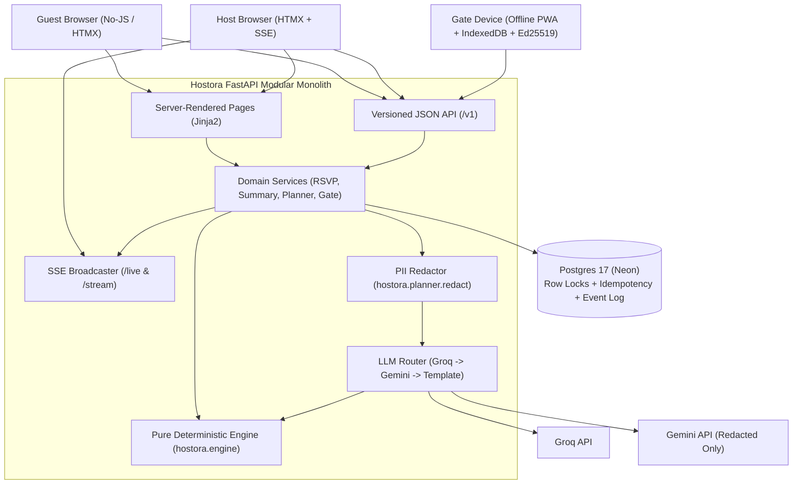
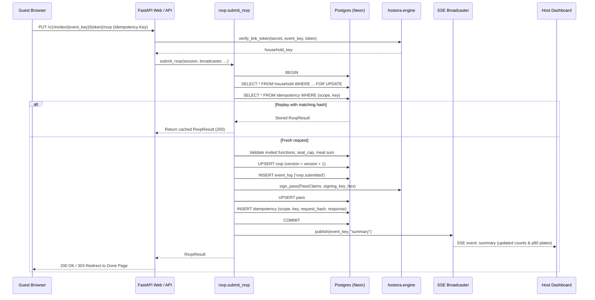

# Hostora Architecture

## Component Diagram

```mermaid
flowchart TD
    Guest["Guest Browser (No-JS / HTMX)"]
    Host["Host Browser (HTMX + SSE)"]
    Gate["Gate Device (Offline PWA + IndexedDB + Ed25519)"]

    subgraph FastAPI["Hostora FastAPI Modular Monolith"]
        Pages["Server-Rendered Pages (Jinja2)"]
        API["Versioned JSON API (/v1)"]
        SSE["SSE Broadcaster (/live & /stream)"]
        Services["Domain Services (RSVP, Summary, Planner, Gate)"]
        Engine["Pure Deterministic Engine (hostora.engine)"]
        Redactor["PII Redactor (hostora.planner.redact)"]
        Router["LLM Router (Groq -> Gemini -> Template)"]
    end

    DB[("Postgres 17 (Neon)\nRow Locks + Idempotency + Event Log")]
    Groq["Groq API"]
    Gemini["Gemini API (Redacted Only)"]

    Guest --> Pages
    Guest --> API
    Host --> Pages
    Host --> API
    Host --> SSE
    Gate --> API

    Pages --> Services
    API --> Services
    Services --> Engine
    Services --> DB
    Services --> SSE
    Services --> Redactor
    Redactor --> Router
    Router --> Groq
    Router --> Gemini
    Router --> Engine
```

## RSVP Submission Sequence

```mermaid
sequenceDiagram
    participant G as Guest Browser
    participant W as FastAPI Web / API
    participant S as rsvp.submit_rsvp
    participant DB as Postgres (Neon)
    participant E as hostora.engine
    participant B as SSE Broadcaster
    participant H as Host Dashboard

    G->>W: PUT /v1/invites/{event_key}/{token}/rsvp (Idempotency-Key)
    W->>E: verify_link_token(secret, event_key, token)
    E-->>W: household_key
    W->>S: submit_rsvp(session, broadcaster, ...)
    S->>DB: BEGIN
    S->>DB: SELECT * FROM household WHERE ... FOR UPDATE
    S->>DB: SELECT * FROM idempotency WHERE (scope, key)
    alt Replay with matching hash
        DB-->>S: Stored RsvpResult
        S-->>W: Return cached RsvpResult (200)
    else Fresh request
        S->>DB: Validate invited functions, seat_cap, meal sum
        S->>DB: UPSERT rsvp (version = version + 1)
        S->>DB: INSERT event_log ('rsvp.submitted')
        S->>E: sign_pass(PassClaims, signing_key_hex)
        S->>DB: UPSERT pass
        S->>DB: INSERT idempotency (scope, key, request_hash, response)
        S->>DB: COMMIT
        S->>B: publish(event_key, "summary")
        B-->>H: SSE event: summary (updated counts & p80 plates)
        S-->>W: RsvpResult
        W-->>G: 200 OK / 303 Redirect to Done Page
    end
```
